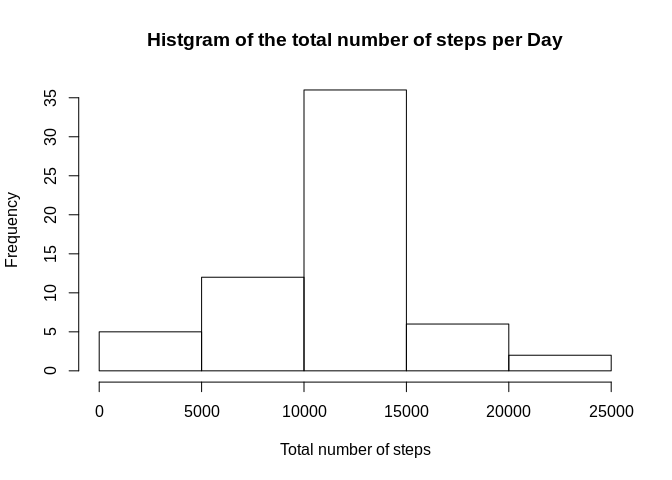

This RMarkdown document describes the analysis and returns the figures
for the first assignment of the Coursera Course "Reproducible Research".

instructions for the assignment1
================================

[the instructions on the coursera
website](https://www.coursera.org/learn/reproducible-research/peer/gYyPt/course-project-1)  
[data used for this
assignment](https://d396qusza40orc.cloudfront.net/repdata%2Fdata%2Factivity.zip)

Information about the data which contains collected data from various
mobile devices tracking steps:  
"This device collects data at 5 minute intervals through out the day.
The data consists of two months of data from an anonymous individual
collected during the months of October and November, 2012 and include
the number of steps taken in 5 minute intervals each day."

1.) Code for reading in the dataset and/or processing the data

    activity <- read.csv("~/Data_Science/reproducible_reserch/assignment1/activity.csv")
    activity$date <- as.Date(activity$date) # transform to dates

1.1) data exploration

    dim(activity)

    ## [1] 17568     3

    str(activity)

    ## 'data.frame':    17568 obs. of  3 variables:
    ##  $ steps   : int  NA NA NA NA NA NA NA NA NA NA ...
    ##  $ date    : Date, format: "2012-10-01" "2012-10-01" ...
    ##  $ interval: int  0 5 10 15 20 25 30 35 40 45 ...

    head(activity)

    ##   steps       date interval
    ## 1    NA 2012-10-01        0
    ## 2    NA 2012-10-01        5
    ## 3    NA 2012-10-01       10
    ## 4    NA 2012-10-01       15
    ## 5    NA 2012-10-01       20
    ## 6    NA 2012-10-01       25

    summary(activity)

    ##      steps             date               interval     
    ##  Min.   :  0.00   Min.   :2012-10-01   Min.   :   0.0  
    ##  1st Qu.:  0.00   1st Qu.:2012-10-16   1st Qu.: 588.8  
    ##  Median :  0.00   Median :2012-10-31   Median :1177.5  
    ##  Mean   : 37.38   Mean   :2012-10-31   Mean   :1177.5  
    ##  3rd Qu.: 12.00   3rd Qu.:2012-11-15   3rd Qu.:1766.2  
    ##  Max.   :806.00   Max.   :2012-11-30   Max.   :2355.0  
    ##  NA's   :2304

    dim(activity[is.na(activity$steps),])

    ## [1] 2304    3

2.) Histogram of the total number of steps taken each day  
Note: we can ignore the missing values at first

    activity_NArm <- activity[!is.na(activity$steps),] #remove NAs
    stepsPerDay <- with(activity_NArm, tapply(steps, date, FUN=sum))
    hist(stepsPerDay, main = "Total number of steps per day", xlab = "Total number of steps")

1.  ) Mean and median number of steps taken each day

<!-- -->

    summary(stepsPerDay)

    ##    Min. 1st Qu.  Median    Mean 3rd Qu.    Max. 
    ##      41    8841   10765   10766   13294   21194

4.) Time series plot of the average number of steps taken

    r1<-with(activity_NArm, tapply(steps, activity_NArm$interval, mean, na.rm=TRUE))
    plot(r1, type = "l", main = "Time series - averaged steps per day per interval", ylab  ="averaged steps", xlab ="intervals")

5.) The 5-minute interval that, on average, contains the maximum number
of steps

    library(data.table)
    library(ggplot2)

    activity_intervals <- activity_NArm[,c(1,3)] # subset data
    activity_intervals$interval <- as.factor(activity_intervals$interval) # factor intervals for plotting
    dF.activity_intervals <- as.data.frame(with(activity_intervals, tapply(steps, interval, mean))) # calculate the mean steps per interval over all days

    dF.activity_intervals <- setDT(dF.activity_intervals, keep.rownames = TRUE) # transform dF for plotting 
    colnames(dF.activity_intervals) <- c("interval", "avSteps")
    dF.activity_intervals <- dF.activity_intervals[order(dF.activity_intervals$avSteps, decreasing = T),][1:10,] # subset top 10 intervals regardinng number of steps
    ggplot(data = dF.activity_intervals , aes(x = reorder(interval, -avSteps), y = avSteps )) + geom_point() + xlab("Intervals") + ylab("Average steps") + ggtitle("Top 10 intervals with most averaged steps") +
      theme(plot.title = element_text(hjust = 0.5))

    top1 <- dF.activity_intervals[1,]

Interval 835 with 206.1698113 steps has on average the highest step
count of all intervals in this dataset.

6.) Code to describe and show a strategy for imputing missing data My
strategy is to compute the mean value of stepts per interval for all
days, excluding the NA values. This average per interval is then
assigned to the corresponding interval for the missing data.  
For example if interval 5 has an average of 0.46 steps over all days,
then the missing interval 5 at Day "2012-10-01" will be imputed with
0.46.

6.1) Code to describe and show a strategy for imputing missing data

    NADates <-unique(activity[is.na(activity$steps), "date"]) # identify the dates with NA 

    activity_intervals <- activity[,c(1,3)] # subset the data to interval and the step columns only
    activity_intervals$interval <- as.factor(activity_intervals$interval) # factor the intervals to assign later an average to each interval 
    meanSteps <- with(activity_intervals, tapply(steps, interval, mean, na.rm = TRUE)) # calculate the mean for each interval
    meanSteps <- as.data.frame(meanSteps) 

    activity[activity$date %in% NADates, "steps"] <- meanSteps$meanSteps # replace the missing values

7.) Histogram of the total number of steps taken each day after missing
values are imputed

    stepsPerDay <- with(activity, tapply(steps, date, FUN=sum, na.rm = TRUE))
    hist(stepsPerDay, main = "Histgram of the total number of steps per Day", xlab = "Total number of steps")

8.) Panel plot comparing the average number of steps taken per 5-minute
interval across weekdays and weekends

    library(dplyr)

    ## 
    ## Attaching package: 'dplyr'

    ## The following objects are masked from 'package:data.table':
    ## 
    ##     between, first, last

    ## The following objects are masked from 'package:stats':
    ## 
    ##     filter, lag

    ## The following objects are masked from 'package:base':
    ## 
    ##     intersect, setdiff, setequal, union

    library(chron)

    #define weekends: 
    activity$weekdays <- weekdays(as.POSIXct(activity$date), abbreviate = F) # add a column with the day names
    activity$weekdays <- as.factor(activity$weekdays) # weekdays to factors
    activity$weekend <- is.weekend(activity$date) # define weekends

    activity[which(activity$weekend == "FALSE"), "weekend"] <- "weekday" # add labels
    activity[which(activity$weekend == "TRUE"), "weekend"] <- "weekend" # add labels

    # calculate the mean steps per interval grouped on weekend and interval 
    daysCompare <- activity %>%   
        group_by(weekend, interval) %>%   
        summarize(steps=mean(steps)) 

    # create a table with the ratio of the steps taken on weekdays and weekends
    daysCompareRatio <- data.table()
    daysCompareRatio <- data.table(daysCompare[which(daysCompare$weekend == "weekday"),"steps"] - daysCompare[which(daysCompare$weekend == "weekend"),"steps"])
    daysCompareRatio$interval <- daysCompare[1:288, "interval"]
    daysCompareRatio$weekend <- "ratio WDay - WEnd"

    # plot the data
    dTPlot <- (merge.data.frame(daysCompareRatio, daysCompare, all = TRUE))

    ggplot(data = dTPlot, aes(x=interval, y=steps, col = weekend)) +facet_grid(weekend~.)  + geom_line() 

